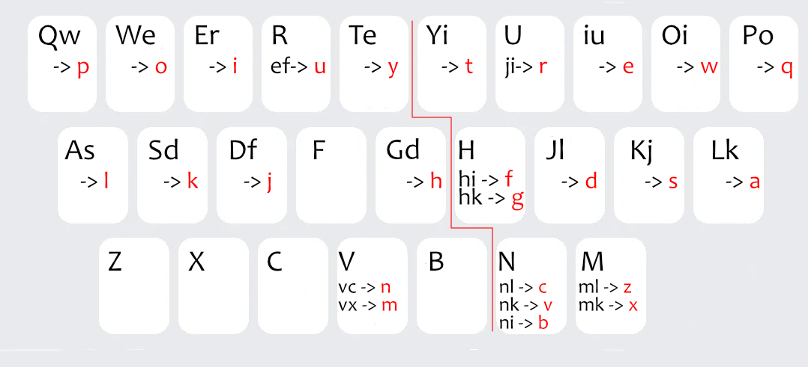

## Rime并击、小鹤音形并击、最简单的并击

[https://github.com/AlexShyXie/FlypyBingji](https://github.com/AlexShyXie/FlypyBingji)

听闻并击很厉害，但是不知道为什么厉害，怎么厉害，于是在各个输入法群里咨询并在网上翻阅大量资料，我终于弄懂了并击是怎么回事。但凡搜索过怎么加快打字速度，都能听说这个并击方案，但是并击实在太小众了，资料极少，所以在这里做一个简单的学习总结，希望像我一样想了解的人，能直接看到我这一篇总结，少一点一脸茫然的时间。

个人猜测：**并击的起源**可以追溯到速录机专用方案。狭义的并击就是指速录机及其配套的打字方法、词库、编码方式和上屏方式。随着技术发展，出现了**26键盘可用的并击**方案，主要通过两种方式实现：

- 使用AutoHotkey软件（如[snochorded](https://github.com/snomiao/snochorded/)）

- 使用Rime输入法（如[rime-shuangpin-fuzhuma](https://github.com/gaboolic/rime-shuangpin-fuzhuma)）

本文重点讨论后者，因为这是大多数普通用户最容易接触到的并击方案。

### 并击的基本原理

**并击的核心原理**是将键盘左右两边都映射出26个字母，实现左手打声母、右手打韵母的分工。这种设计要求**手指具备良好的协调能力**，需要在11、12、21、22等指头模式下灵活操作。

对于**普通双拼改并击**的情况，**重码处理和上屏方式与常规双拼没有区别，仍然依赖原有的辅助码和候选选字机制**。这样的实现方式在速度提升上会有所限制，但是普通双拼改并击也许反而是大家想了解的。

### 速度与复杂度的权衡

如果追求极致速度，像著名的空明码这样的专业并击方案，就不是简单的按键映射了。它们**为了配套的重码方案和上屏方案，会对全部按键进行重新映射**。这也是为什么很多人搜索并击时，看到了空明码，然后进去看教程，就被复杂的教程劝退了。

作为小鹤音形用户，我发现打字速度快时经常出现按键顺序错误，因此开始研究并击。转向空明码成本太高，所以我继续探索普通双拼的并击方案。

### Rime中的并击实现

Rime提供了`chord_composer`模块直接支持并击：

```yaml
# 六、chord_composer_
# 并击把键盘分两半，相当于两块键盘
alphabet: # 字母表，击键按字母表顺序排列
algebra: # 拼写运算规则，转换为拼音音节
output_format: # 并击完成后套用的式样
prompt_format: # 并击过程中套用的式样
```

根据rime-shuangpin-fuzhuma方案，双拼并击可以实现：

- 串击与并击并存

- 正常打字模式

- 单手操作支持

这意味着**形码、辅助码、候选上屏、4码上屏**都可以保留，只需在现有方案基础上添加左右手映射即可。

### 小鹤音形并击实践

在小鹤音形方案中添加并击模块：

```yaml
engine:
  processors:
    - ascii_composer
    - chord_composer # 并击
    - ......
 
chord_composer: # 并击模块设置
  alphabet: "aqzswxdecfrvgtbpolikmujnyh'/"
  algebra:
    # 定义左手11键       
    - xform/^qw(?![左右])/p左/
    # ... 其他映射规则
```

**按键映射设计**遵循我个人舒适度原则。例如：

- 第一排尽量从两边往中间，每2个按键映射对面的一个键，qw映射p，po映射q

- 但是R和U的时候，感觉食指和中指一起按也能当作一个映射，所以就把ef映射成u，ji映射成r

- 第三排的m、n放在vx、vc上

**关键细节**：在方案里修改映射时，使用ji还是ij的写法，需要看alphabet的排列顺序。字母顺序设计为左手字母在前，确保并击出来的字符声母在前。

**实际操作示例**：

- 地(di)：左手声母，并击d和i

- 皮(pi)：p在右手需映射到左手(qw)，并击qwi

- 么(me)：m在右手，e在左手，并击vc出m，iu出e，vciu出么

上屏方式仍然是小鹤音形的4码上屏，没有任何区别。




### 实际使用中的挑战

这种方案容易理解，确实能加快打字速度，但是这样优势其实也有限，空明码并击的优点应该也是要和他们的重码方案配合后才能显现。

其主要挑战在于改变长期形成的打字习惯，串击和并击的区别：

比如：

所有人都习惯**串击**输入，比如打`ve 着`时，会无意识地先按v，然后在**不松开v的情况下按e**。这时系统会识别成并击，编码显示为ev（因为alphabet里e在v前面），这种习惯改变需要时间适应。

另外，虽然并击确实会避免很多难打的键位，但是单键打快了也会误识别为并击，单键的字也不能按太快，按空格上屏也不能太快。感觉如果能适应比较别扭的手法的话也许并击并不能提速。

### 总结与展望
以上是我对并击的理解和实践。多数人可能都是按照"双拼→音形/形码→并击"的路径走过来，那么小鹤音形与并击并存的方案可能正是你想了解的。

这只是一个初步尝试，不一定深入，但记录下来希望能为后来者提供参考。如果理论理解有误，欢迎同道批评指正。

不过本文重点在于并击原理的解说，而非推广特定方案，希望能在网络资料匮乏的当下，为并击添加一份实用的说明文档，各位网友无需对具体的方案好坏做评论，因为我也不一定继续在用了。


